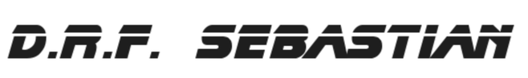

A server-side HTML GUI generator for Django Rest Framework API-First applications.

Sebastian is **S**mart **E**asy **B**ackend **A**pplication **S**tack for **T**ight **I**ntegration of **A**PI and **N**avigation

**Note**: This is a third-party extension for Django REST Framework, and is not an official Django REST Framework project.

> "I make... friends. They're GUIs. My friends are GUIs. I make them."

D. R. F. Sebastian

> "If we give them custom templates, we’d create a cushion, a pillow for their functionalities and consequently we can control them better."

E. Tyrell

> "Skin jobs*"

H. Bryant

_*Replicants of API endpoints with a skin_

## Summary

Sebastian is a Django/DRF snap-in that eliminates API/GUI logic duplication by auto-generating server-side HTML interfaces and interface abstraction data from DRF ViewSets and Serializers. The GUI endpoints are "replicants" of the corresponding API endpoints. Every element of the interface, even the main menu, is rendered by an API endpoint. 

Sebastian provides a declarative mapping between API endpoints and GUI elements (lists, details, forms, actions) without requiring you to write separate forms, views, or templates.

With Sebastian, you implement your business logic in your DRF API (Views and Serializers), enrich it with GUI context metadata, and get an HTML GUI automatically. You can always customize the templates or mix in traditional Django views if you need to do so.

## Project docs

- [Project roadmap](docs/roadmap.md)
- [drf-sebastian framework specifications](docs/sebastian-spec.md)

## Comparison to Alternatives

| Feature | Sebastian | Django Admin | Wagtail | React Admin | FastAPI |
|---------|-----------|--------------|---------|-------------|---------|
| API-first | ✅ Yes | ❌ No | ❌ No | ✅ Yes | ✅ Yes |
| Auto GUI | ✅ Yes | ✅ Yes | ✅ Yes | ✅ Yes | ❌ No |
| DRF Compatible | ✅ Yes | ❌ No | ❌ No | ⚠️ Partial | ❌ No |
| Customizable | ✅ High | ⚠️ Medium | ✅ High | ⚠️ Medium | N/A |
| Learning Curve | ✅ Low | ✅ Low | ⚠️ High | ⚠️ Medium | ⚠️ Medium |
| SPA Support | ✅ Yes | ❌ No | ❌ No | ✅ Yes | ✅ Yes |
| Server-side GUI| ✅ Yes | ✅ Yes | ✅ Yes | ❌ No | ⚠️ Via Jinja |

## Credits

See [CREDITS](CREDITS.md) for details

- Freely inspired by J.F. Sebastian character in Blade Runner (1982)
- **Blade Runner Font** by Phil Steinschneider - https://www.dafont.com/blade-runner-movie-font.font
